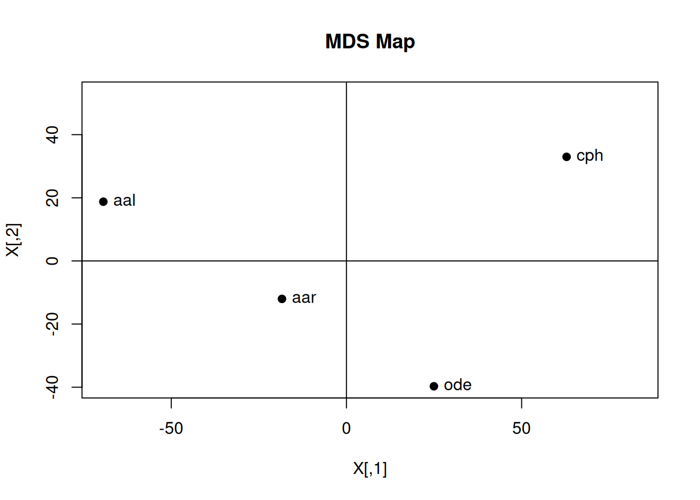

# Multi-Dimensional Scaling

#### Bhuvan Kapoor 

``` r
# Experiment 3
# Aim: Multi-dimensional Scaling 

n <- 4
P <- rbind(c(0,93,82,133),c(93,0,52,60),c(82,52,0,111),c(133,60,111,0))

# Proximity Matrix
P_2 <- P**2
P_2
```

    ##       [,1] [,2]  [,3]  [,4]
    ## [1,]     0 8649  6724 17689
    ## [2,]  8649    0  2704  3600
    ## [3,]  6724 2704     0 12321
    ## [4,] 17689 3600 12321     0

``` r
J <- diag(n) - ((1/n) * matrix(1, nrow = n, ncol = n))
J
```

    ##       [,1]  [,2]  [,3]  [,4]
    ## [1,]  0.75 -0.25 -0.25 -0.25
    ## [2,] -0.25  0.75 -0.25 -0.25
    ## [3,] -0.25 -0.25  0.75 -0.25
    ## [4,] -0.25 -0.25 -0.25  0.75

``` r
# Double Centering Matrix
B <- (-1/2) * J %*% P_2 %*% J
B
```

    ##            [,1]       [,2]       [,3]      [,4]
    ## [1,]  5035.0625 -1553.0625   258.9375 -3740.938
    ## [2,] -1553.0625   507.8125     5.3125  1039.938
    ## [3,]   258.9375     5.3125  2206.8125 -2471.062
    ## [4,] -3740.9375  1039.9375 -2471.0625  5172.062

``` r
eigen_B <- eigen(B)
eigen_B
```

    ## eigen() decomposition
    ## $values
    ## [1] 9.724168e+03 3.160986e+03 3.659656e+01 8.170566e-13
    ## 
    ## $vectors
    ##            [,1]       [,2]         [,3] [,4]
    ## [1,]  0.6371597  0.5864982  0.006882366 -0.5
    ## [2,] -0.1866207 -0.2139168 -0.818176212 -0.5
    ## [3,]  0.2531171 -0.7063152  0.432493393 -0.5
    ## [4,] -0.7036561  0.3337338  0.378800454 -0.5

``` r
eigen_B_values <- eigen_B$values[1:2]
eigen_B_values
```

    ## [1] 9724.168 3160.986

``` r
eigen_B_vectors <- eigen_B$vectors[,1:2]
eigen_B_vectors
```

    ##            [,1]       [,2]
    ## [1,]  0.6371597  0.5864982
    ## [2,] -0.1866207 -0.2139168
    ## [3,]  0.2531171 -0.7063152
    ## [4,] -0.7036561  0.3337338

``` r
Lambda_matrix <- diag(sqrt(eigen_B_values))
Lambda_matrix
```

    ##          [,1]     [,2]
    ## [1,] 98.61119  0.00000
    ## [2,]  0.00000 56.22265

``` r
X <- eigen_B_vectors %*% Lambda_matrix
X
```

    ##           [,1]      [,2]
    ## [1,]  62.83108  32.97448
    ## [2,] -18.40289 -12.02697
    ## [3,]  24.96018 -39.71091
    ## [4,] -69.38837  18.76340

``` r
plot(X, pch = 19, xlim = range(X[,1])+c(0,20), ylim = range(X[,2])+c(0,20), main = "MDS Map")
city_names <- c("cph", "aar", "ode", "aal")
text(X[,1],X[,2],pos = 4, labels = city_names)
abline(v=0,h=0)
```


